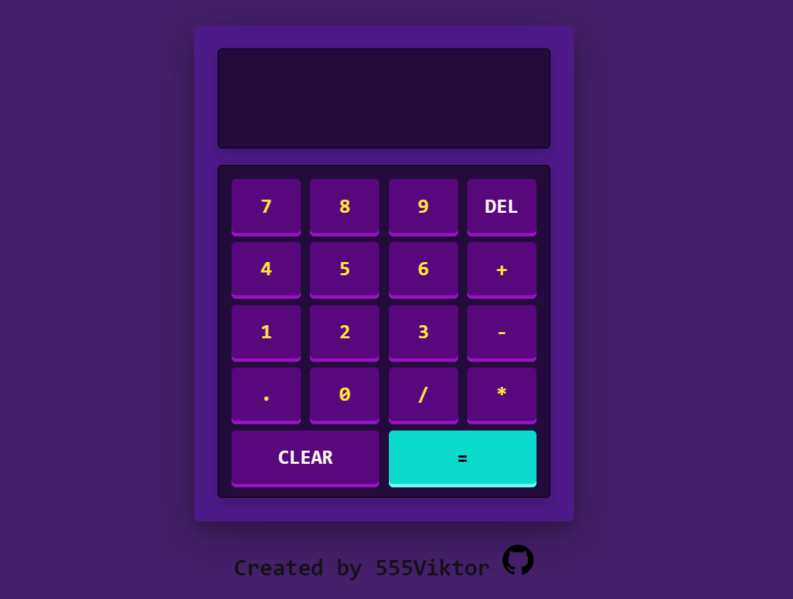

# Calculator App 🧮

[](https://555viktor.github.io/odin-calculator/)

## Live Preview  
Check out the deployed project here: https://555viktor.github.io/odin-calculator/

## Project Overview  
This is a web-based **Calculator App** built using **HTML**, **CSS**, and **JavaScript**. The app features a clean, user-friendly interface and allows users to perform basic mathematical operations. The project was developed as an assignment for **The Odin Project**.

## Features  
This calculator includes the following features:

- **Basic Arithmetic Operations:** Perform addition (+), subtraction (-), multiplication (*), and division (/).
- **Clear Button:** Reset the current input with a single click.
- **DEL:** Remove the last entered digit for corrections.
- **Responsive Layout:** The app adjusts to different screen sizes for a seamless experience on both mobile and desktop.
- **Real-time Display:** See calculations and results instantly as you input numbers and operators.

## Technologies Used  
- **HTML** – To structure the page and layout.
- **CSS** – For styling and making the interface responsive.
- **JavaScript** – To handle the logic behind the calculator's operations and user interactions.

## Installation  
To get started with this project locally:

1. Clone the repository to your machine:
   ```bash
   git clone https://github.com/555Viktor/odin-calculator.git
   ```

2. Navigate into the project folder:
   ```bash
   cd odin-calculator
   ```

3. Open `index.html` in your preferred browser to start using the calculator!

## Usage  

1. **Perform Calculations:**  
   - Click on the number buttons (0-9) to enter digits.  
   - Use the operator buttons (+, -, *, /) to perform arithmetic operations.
   - Arithmetic operations are performed automatically
   - Press the **`=`** button to calculate and display the final result.

2. **Clear and Edit Inputs:**  
   - Use the **Clear** button to reset the current calculation.  
   - Press the **DEL** button to remove the last entered digit or operator.

3. **Responsive Design:**  
   - The calculator is designed to adjust seamlessly to various screen sizes, providing an optimal experience on both mobile and desktop devices.

## Acknowledgements  
This project was built as an assigment from **TOP**'s curriculum. A big thank you to **The Odin Project** for this exercise.
